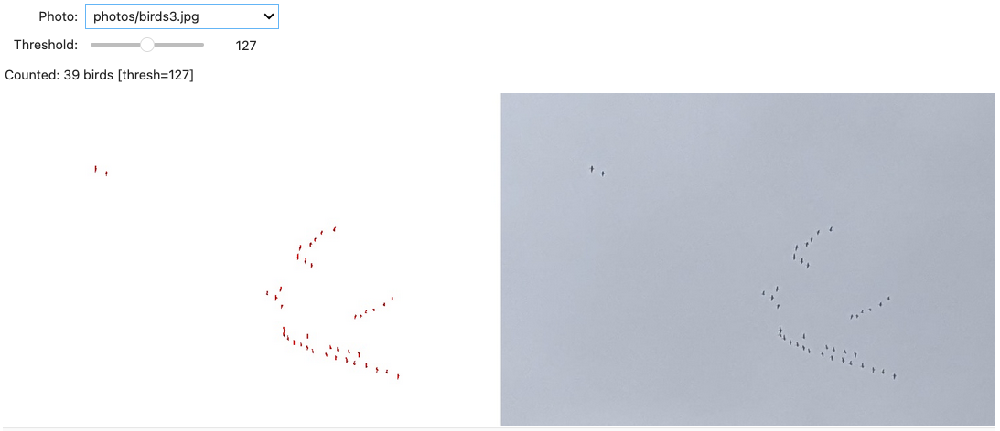

# Birds detection
A script for counting flying birds, captured in a photo.

## The Classifier
The main logic is implemented in `birds.py` file.
It uses [OpenCV](https://opencv.org/) to convert the input image to the grayscale 
and then filter objects from the background based on the threashold value.

## The UI
The User Interface is built as a Jupyter Notebook with Jupyter Widgets.
User may control the threshold value in case the default does not segment birds well.

## Disclaimer
Work in progress. Due to limited data, the process is rather manual 
(threshold requires an adjustment).
